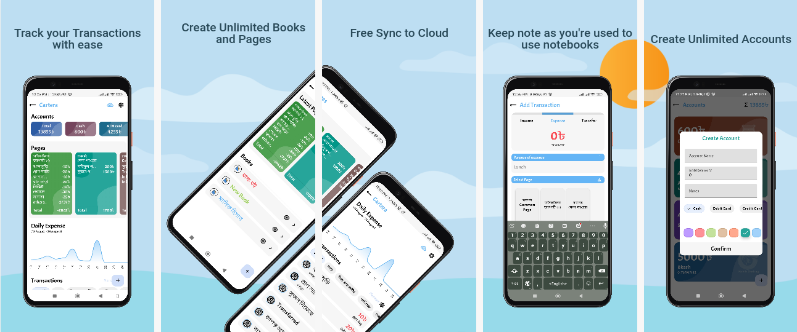
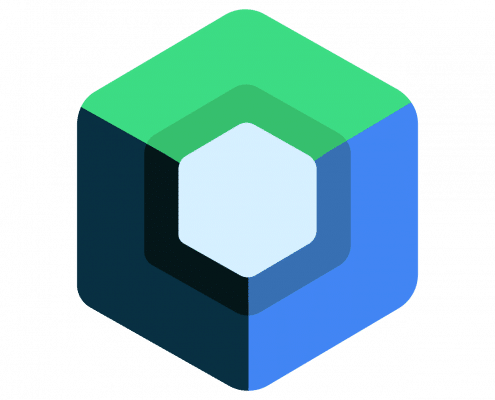

# Cartera

A digital budget and transaction manager.

**Cartera** is a personal money manager and budget app that assists you in managing your money. You may manage your budget, comprehend everyday spending, and save money effectively with the aid of this straightforward finance management app. It is more than just a spending tracker; it also includes a budget planner, intuitive analysis, useful charts, and other features that make it a complete personal finance manager app. Use **Cartera** and observe the changes in your spending habits.

### Main Features

- **Book & Page:** The main theme of this app is to mimic real life uses. Books can hold unlimited pages. Each transaction must be attached to at least one page. 

- **Account:** There is no limit to create accounts.

- **Budget:** Each page can have separate budget. Budget is tracked when a transaction's #tag matches with budget name.

- **Category:** Catagorize your transactions with just adding a tag to it.

- **Export/Import:** Export or Import data locally.

- **Sync:** All data is automatically synced with cloud.

- And many more...

### Library Used

| ObjectBox                                                                                                                                                                                                                                                                                                                                                     | Koin                                                                                | Google Firebase                                                                          | Jetpack Compose                                                                         |
|:-------------------------------------------------------------------------------------------------------------------------------------------------------------------------------------------------------------------------------------------------------------------------------------------------------------------------------------------------------------:|:-----------------------------------------------------------------------------------:|:----------------------------------------------------------------------------------------:| --------------------------------------------------------------------------------------- |
|  |  |  |  |

### Latest Version

| Mega.nz          |
|:--------------------------------------------------------------------------------------------:|
| [Cartera_v1.6.26](https://mega.nz/file/L4J2TDJR#Vee3jVl_QankJDzNMSekFbVHrcCxi03LFY-2Ip25LuE) |
